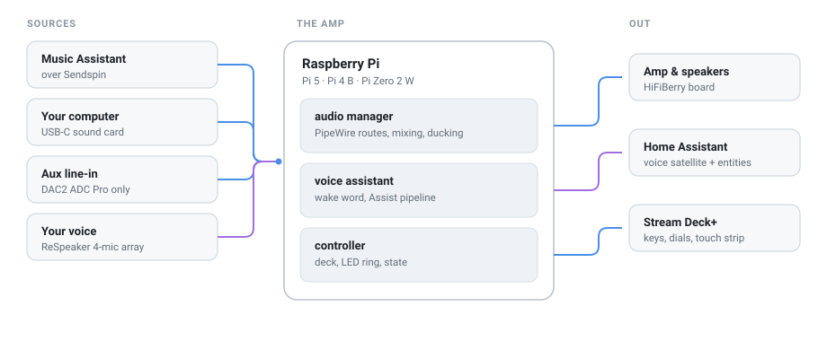

# Pimus Smart Amp 🔊

Turn a Raspberry Pi, a HiFiBerry amplifier, and a microphone array into a
speaker that plays your music, answers when you talk to it, and has real knobs.
One Ansible recipe builds the whole thing on a fresh Raspberry Pi OS Lite
install, over SSH, as many times as you like.



## ✨ What it does

- 🎵 **Plays everything** — Music Assistant over Sendspin, your computer over
  USB-C, an analogue aux input, and whatever Home Assistant sends it.
- 🗣️ **Listens** — local wake word, Home Assistant Assist, spoken replies,
  timers, and announcements, through a four-mic array with echo cancellation.
- 🎛️ **Has controls you can touch** — an optional Stream Deck+ with keys, dials,
  and a touch strip for volume, media, lights, scenes, and timers.
- 💡 **Reacts** — an LED ring that shows what the voice assistant is doing, and
  background audio that ducks out of the way while it talks.
- 🔌 **Behaves itself** — the panel sleeps when the room is empty, the audio
  graph tears itself down when nothing is playing, and it all comes back in
  about a second.

Home Assistant and Music Assistant live on another machine. Each amp is only an
endpoint: no Docker, no local server, no image-building pipeline.

## 🔩 The hardware

| | |
| --- | --- |
| **Brain** | [Raspberry Pi 5](https://www.raspberrypi.com/products/raspberry-pi-5/), [Pi 4 Model B](https://www.raspberrypi.com/products/raspberry-pi-4-model-b/), or [Pi Zero 2 W](https://www.raspberrypi.com/products/raspberry-pi-zero-2-w/) |
| **Sound** | [HiFiBerry DAC2 ADC Pro](https://www.hifiberry.com/shop/boards/hifiberry-dac2-adc-pro/) + [AAmp60](https://www.hifiberry.com/shop/boards/aamp60/), or a [HiFiBerry Amp100](https://www.hifiberry.com/shop/boards/amp100/) |
| **Ears** | [ReSpeaker XVF3800 USB 4-mic array](https://www.seeedstudio.com/ReSpeaker-XVF3800-USB-Mic-Array-p-6488.html) |
| **Hands** *(optional)* | [Elgato Stream Deck+](https://www.elgato.com/us/en/p/stream-deck-plus-black) |

⚡ The amplifier feeds the Pi through the GPIO header, so size its supply for the
whole stack — and read [hardware](docs/hardware.md) before powering it on,
especially if you want the USB-C sound card.

## 🚀 Get started

```sh
make install      # control computer: Ansible collections + Node workspace
make provision    # configure every Pi over SSH
make doctor       # health report
```

Full walkthrough — imaging the card, describing your amps, connecting Home
Assistant and Music Assistant — in [setup](docs/setup.md).

## 🎛️ Everyday control

The Stream Deck+ layout has three pages, navigated from the bottom corners:
**Main** (voice, mic mute, play/pause, shuffle, aux and USB routes), **Room**
(scenes, lights, fan, blinds, timers), and **Info** (clock, temperature, weather,
brightness, playlists). A fourth **Remote** page can be filled by another
computer on the LAN.

Dial 1 is volume, dial 2 is media transport, dial 3 is spare, and dial 4 has no
fixed job — press the lights, fan, or blinds key and that knob becomes its
dimmer, speed, or opener. The touch strip shows what is playing and swaps to the
dial you are turning; Home Assistant automations can put a message on it too.

Every action, page, and dial is in [controls](docs/controls.md). To try a change
with no Pi and no deck attached, `make playground` runs the real controller on
this computer and draws the deck in a browser 🕹️.

## 📚 Docs

| | |
| --- | --- |
| [Hardware](docs/hardware.md) | What to buy, board differences, power, wiring |
| [Setup](docs/setup.md) | Install, provision, connect to HA and MA |
| [Configuration](docs/configuration.md) | Every setting, and what it changes |
| [Controls](docs/controls.md) | Keys, dials, touch strip, and how to rebind them |
| [Architecture](docs/architecture.md) | Services, audio graph, who owns what |
| [Playground](docs/playground.md) | Develop the control surface without hardware |
| [Troubleshooting](docs/troubleshooting.md) | When it does not make a sound |

## 🗂️ Layout

```text
apps/controller      TypeScript daemon: Stream Deck, LED ring, voice state, ducking
apps/audio-manager   Python daemon: PipeWire routes, mixing, ducking gains
apps/playground      Development-only fake hardware, never deployed
ansible/             Inventory, playbooks, and the smartamp role
docs/                You are here
```

Each app owns its own `src/` and `test/`; see [`apps/README.md`](apps/README.md)
for the module boundaries. The Node apps are a pnpm workspace on this computer
only — the Pi installs the controller's exact pins with plain npm.
